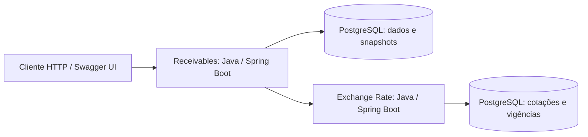

# Decisões e cortes — perspectiva de Tech Lead

As decisões abaixo distinguem implementação atual de evolução proposta. Regras em [SPEC.md](SPEC.md) e pendências em [DELIVERY_STATUS.md](DELIVERY_STATUS.md).

## ADR-001 — PostgreSQL para o núcleo financeiro (adotada)

**Contexto:** status do recebível e liquidação precisam confirmar juntos; retries não podem duplicar registros.

**Decisão:** banco relacional, transação local, constraints únicas e versão otimista. JPA atende comandos; JDBC parametrizado atende relatório.

**Alternativa:** NoSQL exigiria redesenhar atomicidade e unicidade entre agregados sem benefício demonstrado no case. O banco relacional também simplifica conciliação.

**Consequência:** o banco é fronteira de consistência e possível gargalo. Índices e planos de consulta devem ser medidos antes de distribuir dados. Snapshot financeiro é desnormalização intencional para auditoria; não equivale a ledger bancário.

## ADR-002 — Dois módulos com responsabilidades separadas (adotada)

**Decisão:** Receivables e relatórios no mesmo processo; portas e adapters isolam domínio, persistência e HTTP. O módulo [Exchange Rate](../exchange-rate/README.md) cadastra cotações, persiste seu histórico em PostgreSQL e consulta a taxa vigente por par de moedas e instante. MockServer permite executar Receivables isoladamente.

**Motivo da separação:** Exchange Rate concentra o ciclo de vida e a vigência das cotações para consumo por HTTP. Isso adiciona uma fronteira de disponibilidade, tratada pelo cliente com timeout e retry. Relatórios e precificação permanecem em Receivables para limitar o custo operacional.

**Consequência:** leitura e escrita compartilham banco. Extrair projeções quando medições mostrarem interferência relevante no SLO transacional. Java 21, Spring Boot e BigDecimal favorecem tipagem, transações e domínio decimal; o custo é maior configuração e consumo de recursos que uma aplicação menor.

## ADR-003 — Liquidação síncrona; eventos como evolução (adotada/proposta)

**Atual:** HTTP responde após a transação; não existem Kafka, Outbox ou consumidores implementados. Isso reduz a superfície operacional do exercício.

**Proposta EDA:** gravar `SettlementCreated` na Outbox junto de settlement e status. Publicador ou CDC envia ao broker com entrega ao menos uma vez. Consumidor grava `eventId` processado e projeção na mesma transação local. Ordenar por `receivableId`; incluir sequência do agregado, versão do contrato, instante UTC e correlation ID. Reentrega não gera novo efeito.

**Falhas:** crash após publicar e antes de marcar envio causa repetição; consumidores precisam deduplicar. Evento inválido exige quarentena, alerta e replay controlado. Medir idade da Outbox e atraso das projeções. Mudanças de contrato devem permitir coexistência de versões.

**Pagamento externo:** se introduzido, usar intenção durável, ID estável no pagador e conciliação de resultados desconhecidos. Outbox não torna banco e pagador uma única transação ACID.

## ADR-004 — Configuração de spread e Strategy de algoritmo (adotada)

Duplicata e cheque compartilham fórmula; diferem por spread com vigência. Registry escolhe `STANDARD`. Nova fórmula requer Strategy; novo tipo exige expandir enum e contratos, portanto não é cadastro sem deploy. Evita classes que apenas retornam constantes, mantendo ponto explícito de extensão.

## ADR-005 — Precisão e referência temporal (adotada com pendências)

BigDecimal e HALF_EVEN; VP arredondado antes do câmbio, como C3. Prazo é dias corridos/30 com 12 casas; potência usa 34 dígitos. Câmbio e configurações são selecionados na referência da operação. Confirmação do risco cambial e política de cotação antiga dependem do negócio.

A consulta HTTP ocorre dentro da transação, mantendo conexão e bloqueio durante retries. Evolução: obter cotação versionada antes de uma transação curta e revalidar versão/estado e política temporal ao confirmar. Não mover a chamada sem preservar a referência usada no preço.

## Cortes e lacunas assumidas

| Item | Estado e justificativa/impacto |
| --- | --- |
| Frontend | Pendente: painel de simulação e grid de transações. O backend disponibiliza os contratos necessários. |
| Integração entre módulos | Exchange Rate implementa cadastro e consulta de cotações persistentes. O ambiente isolado de Receivables usa mock por padrão; a integração real depende de configurar `EXCHANGE_RATE_BASE_URL`. |
| Kafka/Outbox/read model separado | Apenas proposta; sem consumidor real que justifique implantação no case. |
| Lotes, pagamentos, estorno | Fora da API atual; um recebível por operação. Sem garantias de lote ou pagamento externo. |
| Auth e permissões | Ausentes. Não apresentar como pronto para produção; definir papéis, carteira e identidade antes da exposição. |
| CI/linter e métricas de negócio | Não encontrados nesta pasta; são lacunas de entrega, não requisitos cumpridos pelo Actuator. |
| Container da API | Dockerfile pressupõe estrutura não presente; Compose só atende dependências. Setup completo por Compose permanece pendente. |
| Auditoria reforçada | Sem API de edição, mas sem proteção contra UPDATE/DELETE direto; restringir usuário da aplicação e testar integridade. |

## Design proposto para 1 milhão de transações/minuto

**Hipótese de dimensionamento, não benchmark:** 1.000.000/min ≈ 16.667/s sustentadas. Planejar inicialmente pico de 2× (33.334/s) e validar por teste. A 2 KB por registro/evento, são cerca de 2 GB/min por cópia, antes de índices, WAL, réplicas e retenção. Dimensionar com tamanho real e perfil de leitura; não inferir capacidade só pelo número de partições.

1. API stateless com limites por carteira, backpressure e filas limitadas. Se aceite virar assíncrono, retornar 202 com ID de operação e consulta de status; aceite não significa liquidação concluída.
2. Sharding pela carteira/fundo, com subdivisão determinística por recebível para grandes carteiras. Recebível, settlement e deduplicação devem morar na mesma fronteira transacional. Rebalanceamento requer roteamento versionado e fencing contra dois escritores.
3. Hoje a chave idempotente é global em um banco. Em shards, redefinir contrato para `(carteira, chave)` e garantir roteamento determinístico, inclusive em retry e migração. Se a chave não permitir escolher shard, usar diretório consistente; unicidade local não garante unicidade global.
4. Preservar vínculo chave/conteúdo/resultado. Expiração de cache de deduplicação não autoriza nova liquidação; unicidade permanente por recebível permanece no registro autoritativo. Retenção precisa cobrir reprocessamentos e exigências do negócio.
5. Cachear configurações/cotações por par e versão de vigência. Guardar no snapshot a versão efetiva. Não usar cache como autoridade de status, saldo ou unicidade. Atualizações e invalidação devem preservar histórico.
6. Outbox/CDC alimenta projeções de relatório e agregações por moeda. Leituras analíticas aceitam atraso negociado; confirmação financeira consulta estado autoritativo. Expor watermark/instante de atualização, sem simular consistência imediata.
7. Separar partições de eventos por agregado e medir skew de carteiras. Reprocessar com deduplicação; não prometer exactly-once entre banco, broker e pagador.
8. Testar throughput, p95/p99, espera por locks, saturação de conexões, lag, falha de nó, retry storm e recuperação. Definir RPO/RTO com negócio e testar restauração antes de alegar disponibilidade.

Não há razão demonstrada para Cassandra agora. PostgreSQL particionado, réplicas e projeções são primeiras hipóteses; outra base depende das consultas, retenção e resultados de carga.

## Arquitetura C4 simplificada — estado atual

### Nível 1 — contexto

### Nível 2 — containers

Frontend próprio, broker e banco analítico não fazem parte desse deployment.
