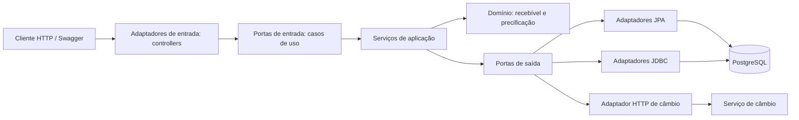
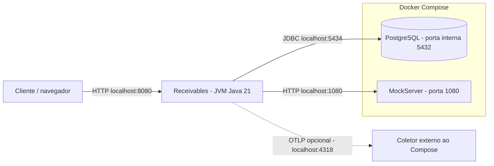
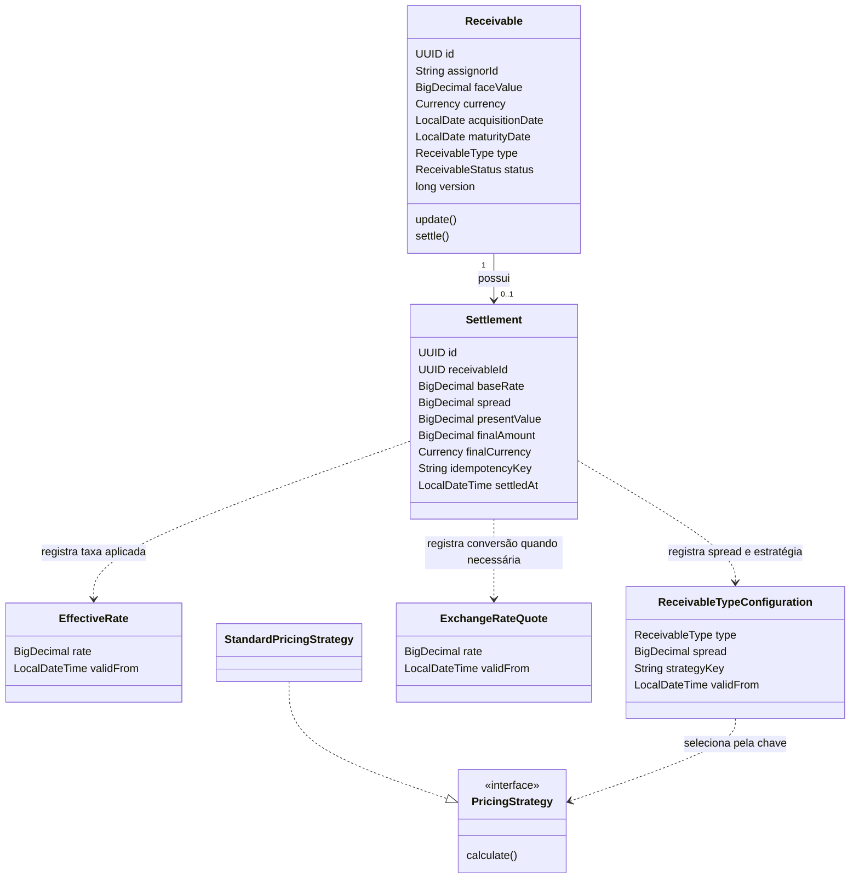
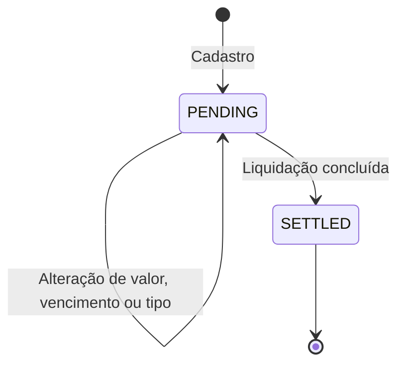
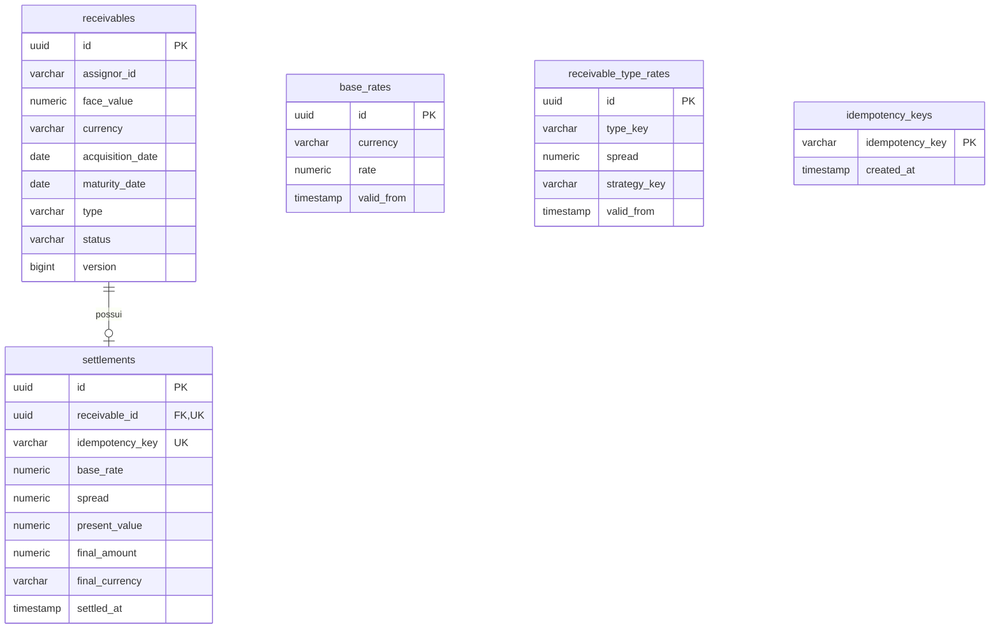
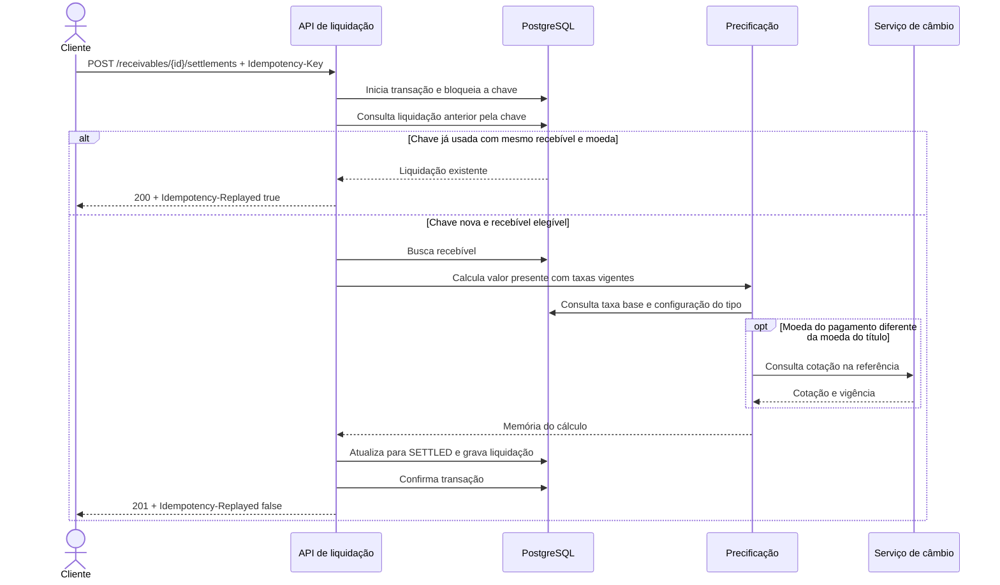

# Receivables

API para cadastrar recebíveis, configurar taxas, simular o valor de antecipação, registrar liquidações e consultar as operações realizadas. Este documento descreve o comportamento implementado no código, a arquitetura e a execução local.

## Índice

- [Visão de negócio](#visão-de-negócio)
- [Tecnologias](#tecnologias)
- [Arquitetura e topologia](#arquitetura-e-topologia)
- [Domínio e persistência](#domínio-e-persistência)
- [Regras de precificação](#regras-de-precificação)
- [Endpoints](#endpoints)
- [Liquidação e idempotência](#liquidação-e-idempotência)
- [Como executar](#como-executar)
- [Exemplo de uso](#exemplo-de-uso)
- [Testes](#testes)
- [Erros e limitações atuais](#erros-e-limitações-atuais)

## Visão de negócio

Um **recebível** representa um direito de receber determinado valor no futuro. A API calcula seu valor presente usando prazo, taxa base e spread, e registra a liquidação na moeda escolhida.

| Conceito | Significado no projeto |
| --- | --- |
| Cedente (`assignorId`) | Identificação de quem cede o recebível. É uma referência textual; não existe cadastro de cedentes nesta API. |
| Valor de face (`faceValue`) | Valor nominal do título no vencimento. |
| Aquisição (`acquisitionDate`) | Data inicial utilizada para calcular o prazo. |
| Vencimento (`maturityDate`) | Data final do título; deve ser posterior à aquisição. |
| Taxa base (`baseRate`) | Taxa definida por moeda, com início de vigência. |
| Spread | Taxa adicional definida por tipo de recebível, com início de vigência. |
| Valor presente (`presentValue`) | Valor de face descontado pelas taxas e pelo prazo. |
| Desconto (`discount`) | Diferença entre valor de face e valor presente. |
| Liquidação (`Settlement`) | Registro definitivo do cálculo e do valor final, que muda o recebível para `SETTLED`. O código não executa transferência bancária. |
| Idempotência | Permite repetir uma solicitação de liquidação sem criar outra operação. |

Moedas disponíveis: `BRL` e `USD`. Tipos disponíveis: `DUPLICATA_MERCANTIL` e `CHEQUE_PRE_DATADO`. A estratégia de precificação implementada é `STANDARD`.

Fluxo habitual: cadastrar o recebível → consultar/configurar taxas → simular condições → liquidar → consultar o relatório. A simulação é independente do cadastro e não é obrigatória para liquidar.

## Tecnologias

Versões declaradas em [pom.xml](pom.xml) e [compose.yaml](compose.yaml):

| Tecnologia | Versão/configuração | Uso |
| --- | --- | --- |
| Java | 21 | Linguagem e runtime; records no domínio e nos contratos. |
| Maven | `pom.xml` | Dependências, compilação, testes e empacotamento. |
| Spring Boot | 4.1.1 | Inicialização e configuração da aplicação. |
| Spring Web MVC / Validation | Gerenciadas pelo Spring Boot | API REST e validação dos corpos de requisição. |
| Spring RestClient / Spring Retry | Retry 2.0.12 | Integração HTTP com câmbio e repetição de chamadas. |
| Spring Data JPA / Hibernate | Gerenciadas pelo Spring Boot | Persistência transacional e controle de versão do recebível. |
| Spring JDBC | Gerenciada pelo Spring Boot | Relatório SQL e bloqueio de chaves de idempotência. |
| PostgreSQL | 17-alpine no Compose | Banco relacional. |
| Flyway | Gerenciada pelo Spring Boot | Migração e carga inicial de taxas. |
| MapStruct / Lombok | MapStruct 1.6.3 | Mapeamento entre objetos e geração de código repetitivo. |
| big-math | 2.3.2 | Potência decimal no cálculo financeiro com `BigDecimal`. |
| springdoc / Swagger UI | 3.1.1 | Contrato OpenAPI e interface para experimentar a API. |
| Actuator / OpenTelemetry | Gerenciadas pelo Spring Boot | Saúde, métricas e rastreamento. |
| Docker Compose / MockServer | MockServer 7.6.0 | Dependências locais e câmbio simulado. |
| Spring Boot Test / JUnit / Mockito / Testcontainers | Dependências de teste | Testes unitários, HTTP, persistência e concorrência. |

## Arquitetura e topologia

O projeto é uma aplicação única organizada em **arquitetura hexagonal (portas e adaptadores)**. Os controllers recebem HTTP, os serviços coordenam os casos de uso e as portas abstraem banco e serviço de câmbio. O domínio concentra as regras e os cálculos.



### Topologia local

O Compose de Receivables contém PostgreSQL e MockServer para execução isolada. O serviço [Exchange Rate](../exchange-rate/README.md) implementa o cadastro e a persistência de cotações com vigência. Para consumir esse serviço, configure `EXCHANGE_RATE_BASE_URL` com sua URL. As APIs são executadas separadamente com Maven ou Java; configure portas distintas ao iniciar ambas na mesma máquina.



Não há broker de mensagens ou processamento assíncrono implementado. A consulta de câmbio faz parte do processamento síncrono de simulações e liquidações que exigem conversão.

### Organização do código

```text
src/main/java/br/com/ibeans/receivables/
├── domain/                 # Recebível, taxas, liquidação e estratégias de cálculo
├── application/
│   ├── port/in/            # Contratos dos casos de uso
│   ├── port/out/           # Contratos de persistência, relatório, câmbio e bloqueio
│   └── service/            # Coordenação de regras e transações
├── adapter/
│   ├── in/web/             # Controllers, DTOs, mapeadores e tratamento de erros
│   └── out/                # Implementações JPA, JDBC e cliente de câmbio
└── config/                 # Relógio, HTTP, retry, precificação e OpenAPI
src/main/resources/
├── application.yml
└── db/migration/V1__init.sql
```

## Domínio e persistência

### Modelo conceitual

As associações com taxas e câmbio abaixo representam dependências do cálculo. A liquidação armazena uma cópia dos valores usados, sem chaves estrangeiras para as configurações.



### Ciclo de vida



Um recebível liquidado não pode ser alterado ou liquidado novamente. Não há endpoints de exclusão, cancelamento ou estorno.

### Modelo relacional



O diagrama resume as colunas. O schema completo está em [V1__init.sql](src/main/resources/db/migration/V1__init.sql).

- `base_rates`: unicidade de `(currency, valid_from)`.
- `receivable_type_rates`: unicidade de `(type_key, valid_from)`.
- `settlements`: no máximo uma liquidação por recebível e uma por chave de idempotência.
- `idempotency_keys`: suporta o bloqueio transacional por chave; não há FK entre essa tabela e `settlements`.
- A liquidação preserva valor de face, prazo, taxas e suas vigências, estratégia, fórmula, versão, cotação e valores resultantes para consulta histórica.

## Regras de precificação

A estratégia `STANDARD`, versão `1`, aplica:

```text
prazoEmMeses = dias corridos entre aquisição e vencimento / 30
valorPresente = valorDeFace / (1 + taxaBase + spread) ^ prazoEmMeses
desconto = valorDeFace - valorPresente
```

As taxas são frações decimais: `0.01` significa 1%. Como o expoente é mensal, taxa base e spread são usados como taxas mensais. O cálculo usa precisão de 34 dígitos e arredondamento `HALF_EVEN`; valor presente, desconto e valor convertido são arredondados para duas casas decimais. O prazo é calculado com até 12 casas decimais.

A taxa base vem da **moeda do recebível**; o spread e a estratégia vêm do **tipo do recebível**. A configuração escolhida é a de maior `validFrom` menor ou igual à data de referência. Uma nova vigência não substitui os registros anteriores.

Na simulação, `referenceDate` é opcional e assume o instante atual quando omitido. Na liquidação, a referência é o instante da operação. O prazo continua sendo aquisição → vencimento, mesmo que a data de referência seja outra. Cadastro, alteração e simulação rejeitam vencimento anterior ao dia atual; a liquidação não repete essa validação de data.

### Conversão cambial

Se a moeda do pagamento for igual à do recebível, não há chamada de câmbio. Caso contrário:

```text
GET {EXCHANGE_RATE_BASE_URL}/api/v1/exchange-rates/{moedaPagamento}/{moedaRecebivel}?at={referencia}
valorFinal = valorPresente / cotacao
```

Exemplo: para pagar em USD um título em BRL, uma cotação USD/BRL de `5.00` significa 5 BRL por USD. Um valor presente de 1.000 BRL resulta em 200 USD.

Esse endpoint pertence ao serviço externo de câmbio, não à API Receivables. O cliente configura 2 segundos para conexão e leitura, até 3 tentativas para `RestClientException`, com intervalo de 150 ms.

## Endpoints

URL local: `http://localhost:8080`. Envie corpos JSON com `Content-Type: application/json`.

Convenções:

- Identificadores de recebível e liquidação são UUIDs.
- Datas: `yyyy-MM-dd`. Data/hora: `yyyy-MM-dd'T'HH:mm:ss`, sem sufixo de fuso; o relógio da aplicação usa UTC.
- Valores decimais nas respostas são strings para preservar precisão.
- Os campos dos corpos abaixo são obrigatórios, exceto `referenceDate` na simulação.

### Catálogo de negócio

| Método e caminho | Significado de negócio | Entrada principal | Sucesso |
| --- | --- | --- | --- |
| `POST /api/v1/receivables` | Registra um título a receber, inicialmente `PENDING`. | `assignorId`, `faceValue`, `currency`, `acquisitionDate`, `maturityDate`, `type`. | `201`, recebível criado com `id`. |
| `GET /api/v1/receivables/{id}` | Consulta dados e situação de um título específico. | UUID no caminho. | `200`, recebível. |
| `PUT /api/v1/receivables/{id}` | Corrige valor de face, vencimento e tipo de um título pendente. Cedente, moeda e aquisição permanecem os do cadastro. | `faceValue`, `maturityDate`, `type`. | `200`, recebível atualizado. |
| `POST /api/v1/pricing/configurations/base-rates` | Cadastra uma taxa base por moeda a partir de determinada vigência. | `currency`, `rate`, `validFrom`. | `201`, taxa e vigência. |
| `GET /api/v1/pricing/configurations/base-rates` | Descobre a taxa base aplicável à moeda em uma data/hora. Não retorna o histórico completo. | Query obrigatória: `currency`, `at`. | `200`, taxa vigente. |
| `POST /api/v1/pricing/configurations/receivable-types` | Define o spread e a estratégia de cálculo para um tipo, com vigência. Não cria novos valores do enum de tipos. | `type`, `spread`, `strategyKey`, `validFrom`. | `201`, configuração criada. |
| `GET /api/v1/pricing/configurations/receivable-types` | Consulta spread e estratégia aplicáveis ao tipo em uma data/hora. | Query obrigatória: `type`, `at`. | `200`, configuração vigente. |
| `POST /api/v1/pricing/simulations` | Estima quanto um título vale para pagamento nas condições informadas, sem salvar recebível ou liquidação. | `faceValue`, `receivableCurrency`, `acquisitionDate`, `maturityDate`, `type`, `paymentCurrency`; `referenceDate` opcional. | `200`, memória do cálculo. |
| `POST /api/v1/receivables/{receivableId}/settlements` | Calcula e registra a liquidação definitiva do título na moeda escolhida. | UUID no caminho, header `Idempotency-Key` e corpo com `currency`. | `201` na criação; `200` na repetição idempotente. |
| `GET /api/v1/reports/settlements` | Lista liquidações para acompanhamento operacional por período, cedente e moeda do pagamento. | Filtros e paginação descritos abaixo. | `200`, `items`, `total`, `page`, `size`. |

Taxas e spreads devem ser maiores ou iguais a zero; valor de face deve ser positivo. A estratégia cadastrada precisa existir no registro de estratégias.

### O que a simulação e a liquidação retornam

A simulação retorna `termMonths`, `baseRate`, `baseRateReferenceDate`, `spread`, `spreadReferenceDate`, `pricingStrategy`, `calculationMethod`, `calculationVersion`, `presentValue`, `presentValueCurrency`, `discount`, `exchangeRate`, `exchangeRateReferenceDate`, `finalAmount` e `finalCurrency`.

A liquidação retorna a memória de cálculo, sem o campo `discount`, acrescida de `id`, `receivableId`, `assignorId`, `faceValue` e `settledAt`. Os campos de câmbio são nulos quando não há conversão. As datas de referência das taxas representam a vigência efetivamente selecionada.

### Filtros do relatório

Todos os parâmetros são opcionais e combinados por `AND`.

| Parâmetro | Comportamento |
| --- | --- |
| `from` | Inclui liquidações com `settledAt` maior ou igual ao instante informado. |
| `to` | Inclui liquidações com `settledAt` menor ou igual ao instante informado. |
| `assignorId` | Correspondência exata do cedente; texto vazio é ignorado. |
| `currency` | Filtra a moeda final do pagamento (`BRL` ou `USD`). |
| `page` | Índice a partir de zero; padrão `0`. |
| `size` | Tamanho de página entre `1` e `200`; padrão `20`. |

Ordenação: `settledAt` decrescente e, em seguida, `id` decrescente. Cada item contém `settlementId`, `receivableId`, `assignorId`, `finalAmount`, `currency` e `settledAt`. `total` é a quantidade de registros que atendem aos filtros, não uma soma financeira. O relatório não valida a ordem de `from` e `to`; um intervalo invertido não encontra registros.

### Documentação e operação

| Caminho | Finalidade |
| --- | --- |
| `/swagger-ui.html` | Interface para consultar contratos e executar chamadas com **Try it out**. |
| `/v3/api-docs` | OpenAPI em JSON. |
| `/v3/api-docs.yaml` | OpenAPI em YAML. |
| `/actuator/health` | Saúde da aplicação. |
| `/actuator/info` | Informações disponibilizadas pelos contributors configurados. |
| `/actuator/metrics` | Métricas disponíveis; `/actuator/metrics/{nome}` consulta uma métrica. |

O YAML inclui `prometheus` na lista de exposição, mas o POM não declara o registry Prometheus; essa configuração isolada não garante `/actuator/prometheus` disponível. A exportação de traces OTLP é opcional e desabilitada por padrão; exportações OTLP de métricas e logs também estão desabilitadas.

## Liquidação e idempotência

A chave `Idempotency-Key` deve ser não vazia e ter até 120 caracteres. A associação considerada para repetição é **chave + recebível + moeda do pagamento**.

| Situação | Resultado atual |
| --- | --- |
| Primeira liquidação válida | `201`, header `Idempotency-Replayed: false`. |
| Mesma chave, mesmo recebível e mesma moeda | `200`, `Idempotency-Replayed: true`, reutilizando a liquidação gravada sem recalcular. |
| Mesma chave com outro recebível ou moeda | `422`. |
| Recebível já liquidado com outra chave | `422` no fluxo de validação de negócio. |
| Disputa concorrente que viola versão ou unicidade | Pode retornar `409`. |



O bloqueio usa `SELECT ... FOR UPDATE` em `idempotency_keys`. A versão JPA do recebível e as restrições únicas complementam o controle de concorrência. Alteração do status e gravação da liquidação pertencem à mesma transação; falhas impedem a confirmação parcial.

## Como executar

### Pré-requisitos

- JDK 21 e Maven disponíveis no terminal.
- Docker com Docker Compose ativo.
- Portas locais `8080`, `5434` e `1080` livres.
- Acesso aos repositórios de dependências Maven e às imagens Docker na primeira execução.

Execute os comandos a partir da pasta que contém este README e o `pom.xml`.

### 1. Iniciar dependências

```sh
docker compose up -d postgres mockserver
docker compose ps
docker compose exec postgres pg_isready -U srm -d exchange_rate
```

Aguarde o PostgreSQL aceitar conexões. O Compose cria o banco **`exchange_rate`**, mas o valor padrão de `DB_URL` no YAML aponta para **`receivables`**. Para usar exatamente o banco provisionado e evitar depender da descoberta automática do Spring Boot, o próximo comando informa a URL e desativa o gerenciamento automático do Compose.

### 2. Iniciar a API

```sh
DB_URL=jdbc:postgresql://localhost:5434/exchange_rate \
SPRING_DOCKER_COMPOSE_ENABLED=false \
mvn spring-boot:run
```

Na inicialização, o Flyway aplica a migração; o Hibernate apenas valida o schema (`ddl-auto: validate`). A migração inicial já insere as configurações abaixo, vigentes desde `2020-01-01T00:00:00`:

| Configuração | Valor inicial |
| --- | --- |
| Taxa base BRL | `0.01` |
| Taxa base USD | `0.004` |
| Spread de duplicata mercantil | `0.015`, estratégia `STANDARD` |
| Spread de cheque pré-datado | `0.025`, estratégia `STANDARD` |

Não é necessário cadastrar novamente essas taxas para os exemplos. Em um banco já migrado, as taxas refletem os dados atuais; o Flyway não repete a carga inicial a cada execução.

### 3. Verificar e acessar

```sh
curl -fsS http://localhost:8080/actuator/health
```

- Swagger UI: <http://localhost:8080/swagger-ui.html>
- OpenAPI JSON: <http://localhost:8080/v3/api-docs>
- OpenAPI YAML: <http://localhost:8080/v3/api-docs.yaml>

Se usar `SERVER_PORT`, ajuste essas URLs.

### Alternativa: executar o JAR

Com as dependências do Compose iniciadas:

```sh
mvn -DskipTests package
DB_URL=jdbc:postgresql://localhost:5434/exchange_rate \
SPRING_DOCKER_COMPOSE_ENABLED=false \
java -jar target/receivables-0.0.1-SNAPSHOT.jar
```

Esse empacotamento não executa testes; veja a seção específica para validação.

O [Dockerfile](Dockerfile) existente pressupõe um contexto de build com `./mvnw` e submódulo `receivables` (`-pl receivables`). A pasta atual não contém esse wrapper nem essa estrutura interna; portanto, `docker build .` nesta pasta não é um caminho de execução validado. O Compose atual também não define um serviço para a API.

### Configuração por ambiente

| Variável | Padrão no projeto | Uso |
| --- | --- | --- |
| `SERVER_PORT` | `8080` | Porta HTTP. |
| `DB_URL` | `jdbc:postgresql://localhost:5434/receivables` | URL JDBC; nos comandos acima é ajustada para `exchange_rate`. |
| `DB_USER` | `srm` | Usuário do banco local. |
| `DB_PASSWORD` | `srm` | Senha do banco local. |
| `EXCHANGE_RATE_BASE_URL` | `http://localhost:1080` | Endereço do serviço de câmbio. |
| `SPRING_DOCKER_COMPOSE_ENABLED` | Definido como `false` nos comandos acima | Deixa o ciclo de vida das dependências sob controle dos comandos Docker. |
| `TRACING_SAMPLING_PROBABILITY` | `1.0` | Probabilidade de amostragem de traces. |
| `OTEL_TRACES_EXPORT_ENABLED` | `false` | Habilita exportação de traces. |
| `OTEL_EXPORTER_OTLP_TRACES_ENDPOINT` | `http://localhost:4318/v1/traces` | Destino OTLP HTTP; coletor não incluído no Compose. |

Se a API for colocada na mesma rede Docker das dependências, os endereços passam a usar os nomes dos serviços, como `postgres:5432` e `http://mockserver:1080`, em vez de `localhost`.

### Câmbio simulado e encerramento

O mock carrega [expectations.json](mocks/exchage_rate/expectations.json) ao iniciar. Retorna cotações fictícias fixas: USD/BRL = `5.00`, BRL/USD = `0.20`, pares iguais = `1.00`. Exige `at` não vazio, mas não filtra por histórico; a vigência retornada é `2000-01-01T00:00:00`.

Após editar as expectativas:

```sh
docker compose restart mockserver
```

Detalhes e chamadas: [README do mock](mocks/exchage_rate/README.md) e [requests.http](mocks/exchage_rate/requests.http).

Interrompa a API com `Ctrl+C` e pare as dependências mantendo os containers:

```sh
docker compose stop
```

O Compose não declara um volume nomeado para o banco. Não dependa de recriação de containers para preservar dados locais.

## Exemplo de uso

Os exemplos usam as taxas iniciais. Ajuste aquisição e vencimento quando necessário: o vencimento deve ser posterior à aquisição e não estar no passado em relação ao relógio UTC da aplicação.

### 1. Consultar as configurações vigentes

```sh
curl -sS 'http://localhost:8080/api/v1/pricing/configurations/base-rates?currency=BRL&at=2026-09-14T10:00:00'
curl -sS 'http://localhost:8080/api/v1/pricing/configurations/receivable-types?type=DUPLICATA_MERCANTIL&at=2026-09-14T10:00:00'
```

Para criar outras vigências, os corpos dos respectivos POSTs são, por exemplo:

```json
{"currency":"BRL","rate":0.012,"validFrom":"2027-01-01T00:00:00"}
```

```json
{"type":"DUPLICATA_MERCANTIL","spread":0.016,"strategyKey":"STANDARD","validFrom":"2027-01-01T00:00:00"}
```

A mesma combinação de moeda/tipo e vigência não pode ser cadastrada duas vezes.

### 2. Simular

```sh
curl -sS -X POST http://localhost:8080/api/v1/pricing/simulations \
  -H 'Content-Type: application/json' \
  -d '{
    "faceValue": 10000.00,
    "receivableCurrency": "BRL",
    "acquisitionDate": "2026-09-14",
    "maturityDate": "2027-09-14",
    "type": "DUPLICATA_MERCANTIL",
    "paymentCurrency": "USD",
    "referenceDate": "2026-09-14T10:00:00"
  }'
```

A resposta mostra valor presente em BRL e valor final em USD. A simulação não gera um identificador de recebível persistido nem reserva as taxas para uma futura liquidação.

### 3. Cadastrar o recebível

```sh
curl -sS -X POST http://localhost:8080/api/v1/receivables \
  -H 'Content-Type: application/json' \
  -d '{
    "assignorId": "CEDENTE-001",
    "faceValue": 10000.00,
    "currency": "BRL",
    "acquisitionDate": "2026-09-14",
    "maturityDate": "2027-09-14",
    "type": "DUPLICATA_MERCANTIL"
  }'
```

Copie o campo `id` retornado para a variável abaixo:

```sh
RECEIVABLE_ID='substitua-pelo-uuid-retornado'
curl -sS "http://localhost:8080/api/v1/receivables/$RECEIVABLE_ID"
```

Se precisar alterar o título antes de liquidar:

```sh
curl -sS -X PUT "http://localhost:8080/api/v1/receivables/$RECEIVABLE_ID" \
  -H 'Content-Type: application/json' \
  -d '{"faceValue":10000.00,"maturityDate":"2027-09-14","type":"DUPLICATA_MERCANTIL"}'
```

### 4. Liquidar e repetir com segurança

```sh
curl -i -X POST "http://localhost:8080/api/v1/receivables/$RECEIVABLE_ID/settlements" \
  -H 'Content-Type: application/json' \
  -H "Idempotency-Key: liquidacao-$RECEIVABLE_ID" \
  -d '{"currency":"USD"}'
```

Repita o mesmo comando: o primeiro retorno é `201`, e o seguinte é `200` com `Idempotency-Replayed: true`. A liquidação utiliza as configurações vigentes no instante em que é realizada, portanto pode diferir de uma simulação com referência histórica.

### 5. Consultar o relatório

```sh
curl -sS 'http://localhost:8080/api/v1/reports/settlements?assignorId=CEDENTE-001&currency=USD&page=0&size=20'
```

## Testes

Testes unitários e de adapters usam Spring Boot Test, JUnit, Mockito e AssertJ. Há testes de integração HTTP com sufixo `IT` que herdam de `AbstractIT` e usam o banco do Compose; o teste de concorrência usa PostgreSQL via Testcontainers.

**Use um ambiente de testes descartável:** `AbstractIT` apaga os registros de recebíveis, liquidações, chaves e configurações antes e depois de cada teste. Não aponte esses testes para um banco com dados que deseja manter. Após essa limpeza, reiniciar a aplicação não recarrega os seeds de uma migração já aplicada.

Para executar os testes selecionados pelo padrão do Surefire, incluindo o teste de concorrência quando houver Docker:

```sh
mvn test
```

Sem Docker, o teste de concorrência está configurado para ser ignorado. Os testes com sufixo `IT` não fazem parte da seleção padrão, e o POM não configura Failsafe. Para incluí-los explicitamente junto com os testes usuais, em ambiente descartável:

```sh
mvn -Dtest='*Test,*IT' test
```

Os testes `AbstractIT` habilitam a integração com Compose por configuração própria. Verifique o banco usado pelo contexto de teste antes de executar a suíte completa. Relatórios do Surefire são gerados em `target/surefire-reports`.

## Erros e limitações atuais

Erros são representados com `application/problem+json`, usando campos de Problem Details (`type`, `title`, `status`, `detail`, e `instance` quando preenchido), `code`, `traceId` quando há span ativo e `violacoes` em falhas de validação de campos.

| HTTP | Situações |
| --- | --- |
| `400` | Corpo inválido, enum/data/UUID inválido, taxa negativa, vencimento inválido, chave vazia ou maior que 120 caracteres, paginação fora dos limites. |
| `404` | Recebível inexistente ou ausência de configuração vigente para moeda/tipo. |
| `409` | Restrição de integridade, configuração duplicada ou conflito de versão. |
| `422` | Conflitos de negócio de liquidação, como chave reutilizada com outros dados ou recebível já liquidado. |
| `500` | Exceção não tratada especificamente ou falha de infraestrutura mapeada para esse status. |
| `503` | Exceções do tipo `ServiceUnavailableException`; não há conversão automática de toda falha HTTP de câmbio para esse tipo. |

Códigos de negócio presentes: `RECE001`/`RECE002` para configuração não encontrada, `RECE003` para conflito da chave, `RECE004`/`RECE006` para recebível já liquidado e `RECE005`/`RECE007` para recebível não encontrado. Erros genéricos usam `EXRA` seguido do status HTTP.

Comportamentos que merecem atenção ao integrar:

- A tentativa de alterar um recebível `SETTLED` lança `IllegalStateException`, atualmente capturada pelo handler genérico como `500`, embora a origem seja uma regra de domínio.
- Falhas de chamada ou respostas inválidas do serviço de câmbio podem chegar ao handler genérico como `500` após as tentativas aplicáveis.
- Não há autenticação/autorização configurada no código analisado.
- Não há listagem geral de recebíveis, consulta individual de liquidação, estorno, exclusão ou transferência bancária implementados.

### Fontes da documentação

As descrições foram conferidas com os [controllers](src/main/java/br/com/ibeans/receivables/adapter/in/web), [serviços](src/main/java/br/com/ibeans/receivables/application/service), [domínio](src/main/java/br/com/ibeans/receivables/domain), [configuração](src/main/resources/application.yml), [migração](src/main/resources/db/migration/V1__init.sql) e [Compose](compose.yaml). Os comandos de execução descrevem o ambiente local. O estado dos testes e as pendências estão em [DELIVERY_STATUS.md](DELIVERY_STATUS.md).


## Documentação da entrega e estratégia Git

- [SPEC](SPEC.md): premissas, precisão e critérios de aceite.
- [DECISIONS](DECISIONS.md): ADRs, cortes, C4, proposta EDA e escala.
- [REVIEW](REVIEW.md): revisão do Anexo A por severidade.
- [POST_MORTEM](POST_MORTEM.md): exercício hipotético do Anexo B.
- [AI_USAGE](AI_USAGE.md): uso informado de IA e erro documental detectado.
- [DELIVERY_STATUS](DELIVERY_STATUS.md): componentes implementados e pendências.

Estratégia proposta: GitHub Flow, com branches curtas por alteração, Conventional Commits e PR para a branch principal protegida. É adequada a um projeto pequeno com integração frequente, sem custo de branches permanentes por release. Cada PR deve explicar problema, decisão, riscos e evidência dos testes; mudanças financeiras exigem revisão das invariantes. A pasta disponibilizada não contém repositório Git reconhecido; essa estratégia não comprova histórico ou PRs existentes.
